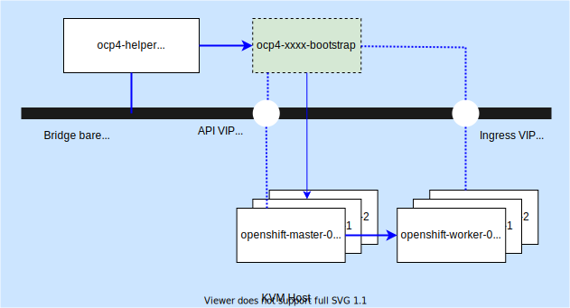

## OpenShift IPI Deployment on BareMetal

This repo is designed to deploy a Red Hat OpenShift cluster with IPI method on a BareMetal server. 



- Host: RHEL8, 32 cores, 128G RAM
- BareMetal Network: 192.168.58.1/25
- Helper VM: 192.168.58.15, CentOS8Stream
- Bootstrap Node: Dynamic IP
- Control Plane:
  - openshift-master-0: 192.168.58.21
  - openshift-master-0: 192.168.58.22
  - openshift-master-0: 192.168.58.23
- API VIP: 192.168.58.103
- Ingress VIP: 192.168.58.102
- Base Domain: virtual.cluster.lab
- Cluster Name: hub

### Quick Start

```shell

git clone https://github.com/borball/ocp-baremetal-ipi.git
cd ocp-baremetal-ipi
git checkout bos2-disconnected
#Update config.cfg before running setup.sh, especially for the dns server.

./setup.sh
```

Once all steps completed successfully, all files in folder helper_node will be rsync to the created helper VM, you will be sshing to the helper node automatically.

```shell
cd hub-installer
# It may take more than 1 hour to finish,
# you may want to run it in the backend. i.g. nohup ./install.sh &
./install.sh
```

After around 1 hour an OpenShift cluster will be installed:

```
# oc get clusterversion
NAME      VERSION   AVAILABLE   PROGRESSING   SINCE   STATUS
version   4.10.14   True        False         7d14h   Cluster version is 4.10.14

# oc get nodes
NAME                                      STATUS   ROLES           AGE     VERSION
openshift-master-0.outbound.vz.bos2.lab   Ready    master,worker   7d14h   v1.23.5+b463d71
openshift-master-1.outbound.vz.bos2.lab   Ready    master,worker   7d14h   v1.23.5+b463d71
openshift-master-2.outbound.vz.bos2.lab   Ready    master,worker   7d14h   v1.23.5+b463d71

```

### Olm Catalog Mirror

```shell
./mirror-olm-catalog.sh
```

### Cleanup

On the host:
```shell
./clean.sh
```

All the VMs and network will be deleted so nothing left on the host.

